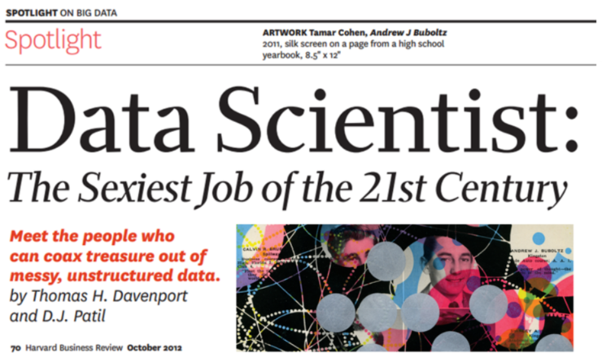
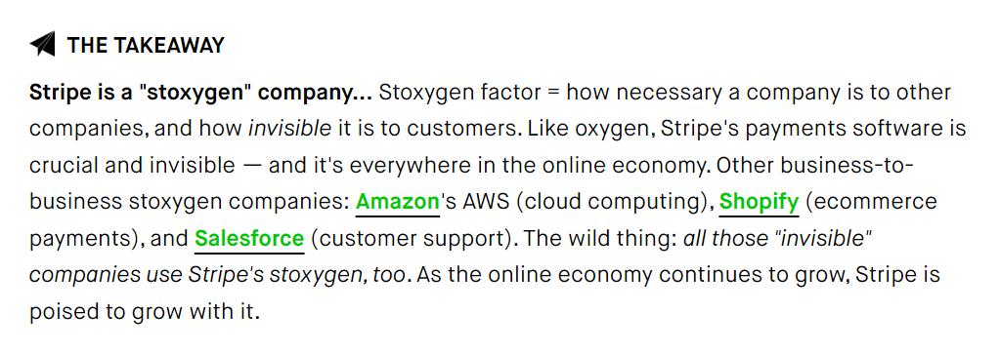

### Data Science Careers

  

(Published by Harvard Business Review in October 2012)
---

### The Last Decade (The Golden Age)

* The 2012 Harvard Business Review article titled ***"Data Scientist: The Sexiest Job of the 21st Century"*** marked a pivotal shift in how the role of data scientists was viewed across industries.

* Sparking considerable debate, the article highlighted the rapid rise in demand for professionals capable of extracting insights from vast, complex datasets and translating them into actionable business value.

* This surge in interest was mirrored by the growing popularity of tools like **R** and **Python**, alongside an explosion of online courses, bootcamps, and self-paced learning platforms catering to aspiring data professionals.

* In response, **universities began establishing dedicated undergraduate and postgraduate degree programs** focused on data science, analytics, and machine learning.

* At the same time, companies—from agile startups to global multinationals—**started building out dedicated analytics departments and hiring data scientists in droves**, recognizing the strategic edge that data-driven decision-making could provide.

---

### Data Science Careers

  

---

### <tt>Tweet by @Type_Error</tt>

 

---

### Domain Knowledge 

* Michael Green  (Data Scientist @ NIM)

Comments on LinkedIn

https://www.linkedin.com/feed/update/urn:li:activity:6765853465861267456/

---

### Importance of Domain Knowledge (1)

 

(*screenshot of LinkedIn Post listed previously - Part 1*)

---

### Importance of Domain Knowledge (2)

 
(*screenshot of LinkedIn Post listed previously  - Part 2*)

---

### Importance of Domain Knowledge (3)

 
(*screenshot of LinkedIn Post listed previously - Part 3*)

---

### Stripe

---

### Career Strategy

Think about tedious boring jobs that can be automated, and processes that can be made more efficient

 