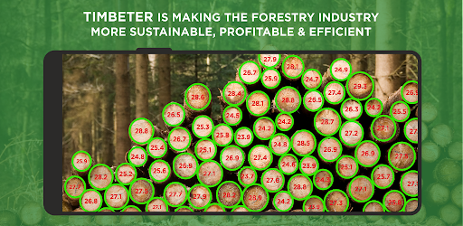

```{r setup1, include=FALSE}
knitr::opts_chunk$set(echo = TRUE)
library(magrittr)
library(knitr)
library(tidyquant)
library(ggside)
library(ggplot2)


```

```{r xaringan-themer, include=FALSE, warning=FALSE}
library(xaringanthemer)
style_mono_accent_inverse(
  base_color = "#FFD580",
  #base_color = "#65FE08",
  header_font_google = google_font("Josefin Sans"),
  text_font_google   = google_font("Montserrat", "300", "300i"),
  code_font_google   = google_font("Fira Mono")
)
```

```{r setup, include=FALSE}
knitr::opts_chunk$set(echo = TRUE)
```

### Kevin O'Brien

- Agricultural Data Scientist based in the West of Ireland 
  - Also in London, UK a lot
  
- Was previously (what is now known) as a "Research Software Engineer" in a University.

- R, Python, SQL now with the aid of AI
  
<p>

#### Previously 

- Why R? - Community Team lead & Webinars co-ordinator (on hiatus)

- Python Ireland - Director and Conference Lead

- UseR! 2024 - Social Media Co-Chair


---


---

### Agriculture and Forestry


* R is very useful in Agriculture, Food and Forestry 

* Last year, I discussed R in Forestry Sector
 - Diameter at Breast Height / Height
 - Growth Curves and Yield Models
 - Statistical Analysis and Data Visualization
 
* Other R packages have been ***VERY*** useful 




---
## Talk Outline - Part 1 (15 min)

<span style="color:#3C989E;">**Strategizing Career Development**</span>


* How to build a career as a data scientist 
 - (or whatever term we will use in the future)

<p>

<span style="color:#3C989E;">**Embracing AI in Data Science**<span style="color:red">**(NEW!)**</span></span>


* The rapidly evolving AI Landscape, and how it affects coders

* AI as Your Coding Partner and Mentor

 - How AI assists with code generation, boilerplate, and suggestions.

* Best Practices and what to avoid

 - Integrating AI effectively into your workflow.

---

### Part 2: Working with Documents with R (25 min)

* Defining "Documents": Focus on Word (*.docx*) and PDF (*.pdf*) in a corporate context.
   - Iterative Dashboards and Quarto are separate subjects.

* Why R for Documents?: Reproducibility, automation, and integration benefits.

* Word Documents with `{officer}`: Creating and manipulating Word files programmatically.

* Enhanced Tables with `{flextable}`: Crafting beautiful, custom tables.

* PDF Interaction with `{pdftools}`: Extracting data and metadata from PDFs.

* Essential R Skills: Highlighting sf, lubridate, and stringr for document tasks.

---

```{r child="Career.Rmd"}
```


---
```{r child="Expert_Beginner.Rmd"}
```

---


```{r child="Prompt_Engineering.Rmd"}
```


---

### Voice To Text


<center>
  
</center>

* Voice To Text Transcription App on my mobile phone
* Generate an unedited **Context File**
---

### Editing Your AI outputs


<center>
  
</center>

* Can generate large volumes of AI generated content quickly.
* Edit, Refine and Test it on a regular basis
---


```{r echo=FALSE}
### CAREER
# - FINISHED
```


---

## Part 2 - The R Packages
---

```{r child="excel.Rmd"}
```

---

```{r echo=FALSE}
### FILES AND DIRECTORIES
# add {here} CRAN website
```

---


### Working with Documents

* Agriculture and Forestry is highly regulated in Ireland 
  - (Water quality, natural heritage, habitats)
  
* Lots of documents

* Government agencies strongly prefer Microsoft Word and PDFs

* Legal Documents

* Time consuming


---

```{r child="pdftools.Rmd"}
```

---

```{r child="doconv.Rmd"}
```

```{r echo=FALSE}
### doconv
# - Finished 
```


---

```{r child="stringr.Rmd"}
```
---

### Officerverse

* David Gohel

* https://www.ardata.fr/
* davidgohel.github.io

#### R Packages

* Officer 
* Flextable 
* Officedown


---


```{r child="officer.Rmd"}
```
```{r echo=FALSE}
### OFFICER
```

---


```{r child="flextable.Rmd"}
```


---

### Useful R packages

* <tt> {tidyverse} </tt>
* <tt> {janitor} </tt>
* <tt> {scales} </tt>

### Useful Commands

* <tt> sprintf() </tt>

---

```{r child="Files_And_Directories.Rmd"}
```


---
