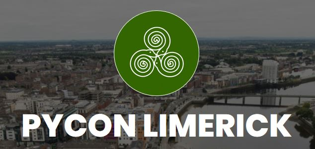

```{r setup, include=FALSE}
knitr::opts_chunk$set(echo = TRUE)

```

Kevin O'Brien
=====================

Column {.tabset}
--------------


### Kevin O'Brien

---------------------

<h4> About Me </h4>

- Agricultural Data Scientist based between the West of Ireland and London (UK)

- Was (what is now known) as a "Research Software Engineer" in a University.

- Former University Lecturer of Mathematics and Statistics. 

  * Maths and Statistics Students (Teaching R)
  * Health sciences, Life Sciences, Equine science, Sports Science, Food science, Biochemistry 

---------------------

<h4> Affiliations</h4>

- <a href= "www.whyr.pl">Why R? Foundation</a> - Community Team lead & Webinars co-ordinator (on hiatus)

- <a href= "www.JuliaCon.Org">JuliaCon 2023</a> - Social Media Chair (2017 to 2023)

- <a href= "www.Python.ie">Python Ireland</a> - **Former** Director & Conference Lead 

---------------------

#### Research Software Engineering

* Research software engineering is the use of software engineering practices in research applications. 

* The term was proposed in a research paper in 2010 in response to an empirical survey on tools used for software development in research projects. 

* It started to be used in United Kingdom in 2012, when it was needed to define the type of software development needed in research. 

* This focuses on reproducibility, reusability, and accuracy of data analysis and applications created for research.


Why R? Foundation {data-navmenu="Rstats"}
===========================================

Column {.tabset}
--------------------


### Why R? Foundation

<h4>Why R? Foundation </h4> 

* The Why R? webinar series took place between April 2020? And May 2021. In total, there were more than 50 webinars encompassing a wide variety of topics relation to the R programming language. 

* In addition to the webinar series, there were two online conferences that took place in December 2020 and December 2021. 

R Talks 
=====================

Column {.tabset}
--------------

### Working With Documents

<h3> Working With Documents</h3>

* Presented at the <a href="www.meetup.com/LondonR">London R</a> Meetup in June 2022

*  <a href="London_R_June_2022/London_R_June_2022.html">Working With Documents</a>


### Older Talks

<h4> "Probability: Pitfalls, Paradoxes"</h4>
* Versions in various programming languages to be revised in 2024
* Monty Hall Problem, The Monte Carlo Gambler's Ruin of 1913, The Canadian Lottery Winner.
* Implementation of several topics discussed in "The Drunkard's Walk"

<h4> Diagnostics and Model Appraisal for R</h4>
* Model Diagnostics for Linear Models and GLMs
* Graphical Procedures i.e. QQ plots, In-built model diagnostic plots, Radio Plots
* Cooks' Distance, Mahalanobis Distances, DFFITS, DFBETAs

```{r child="rstats/linkedin.Rmd", eval=FALSE}
```


PyData Global 2022 {data-navmenu="Python"}
===========================================

Column {.tabset}
--------------------

### PyData Global

<h4> PyData Global </h4>

PyData Global 2022 Conference is taking place online between Thurs 1st and Sat 3rd December 2022.
Join PyData for our third year hosting this event virtually bringing together PyData Chapters, community members, and attendees from all over the world together for an unforgettable PyData Conference.
<p>
To find out more, go to our conference website: <a href="www.pydata.org/global2022">www.pydata.org/global2022</a>


#### Call For Proposals

The CFP is still open until September 12th, 2022.  

We welcome attendees with wide varieties of experiences, expertise, and backgrounds to create a diverse and compelling learning opportunity. Users, contributors, and newcomers can share experiences and learn from one another to solve hard problems and grow a stronger community. nAs well are regular presentations, Workshops and Lightning Talks are also welcome.

Presentations will be given live with opportunities for questions and answers to facilitate a more engaging experience and a deeper discussion. Presentations will come in a variety of formats, such as workshops, talks, and panel discussions to create diverse learning experiences.

Following each session, a recording will be posted to attendees for continued viewing. At the conclusion of the Summit, all presentations will be posted on YouTube.


#### Pay What You Can
Tickets are currently on sale and once again we’ll be using a pay-what-you-can pricing model to maximize the number of community members able to participate in this world-class programming. 

#### Talks, Tutorials & Keynotes - Something for Everyone
At PyData Global 2021, there was over 150 presentations this year including "Wounds Over Time - Tracking Wound Healing via 3D Models”, “Document your scientific project with Markdown, Sphinx, and Read the Docs”, "NLP and Hate speech: Why does it matter and what can we do?”. 
Keynote addresses were be given by Naomi Ceder and David Beazley


#### Keep In Touch
To stay up-to-date on all conference announcements:

* Follow the ***PyData Global*** company page on LinkedIn: <a href="https://www.linkedin.com/company/74716291">PyData Global</a>

* Follow <a href="http://www.twitter.com/pydata">PyData</a> on Twitter


PyCon - Everybody Pays Principle {data-navmenu="Python"}
===========================================

Column {.tabset}
--------------------

### PyData Global

#### PREAMBLE
There's been some recent discussion about DjangoCon(.eu | .us) and whether or not speakers should have to pay for admission as well - see Chris Wanstrath's (of Github) tweets (here and here) and this Convore thread for examples. Obviously, as PyCon is the "big dog" so to speak for Python conferences, everyone looks to "us" for a model to work from, or how we manage things. I've seen a lot of poop slung towards the DjangoCon organizers, mainly due to a lack of knowing "why" certain policies (such as "Everyone Pays") exist for DjangoCon, PyCon, and other conferences.

As co-chair and program committee chair last year, and program committee chair the year before, and now chair for the next two years - I figured it might be good to take a moment to explain the rationale behind PyCon's approach - as well as some statistics about the budget. I'm not going to state that this policy is perfect; nor that it won't be changed; I also will not release the budget publicly - I don't think giving everyone a spreadsheet without the context of the hundreds of man hours of work that go into it is useful, at all.

Important Note: PyCon is organized and managed by the Python Software Foundation - this means that, as part of being a 501c3 charity, some of the financials from past PyCon is available as part of publicly accessible financial documents of the foundation. You can find those on the PSF's site.

The same reasoning may not apply to a conference that is organized by a commercial entity or is done for profit. OSCON is a commercial conference, so having speakers get in free is generally expected. DjangoCon.us is in the middle - it is organized for profit by a commercial entity, but it also contributes heavily back to the Django Software Foundation. DjangoCon.eu is managed differently as well.

#### POLICY AND FINANCIAL AID
First, what is the "policy" - well, first, it's not a policy per-se; it's part policy, and part tradition. The policy is "Everyone pays for a ticket" - attendees, tutorial presenters, organizers (meaning: all volunteers, including the chair) and sponsors - everyone pays their way. Yes, this means Van and myself both paid for our own tickets to attend. Everyone is treated as equal - sponsors get free admissions as part of conference sponsorship packages, and keynote speakers may be provided with either compensation or admission depending on the negotiated deal (some keynote speakers cost money, for example).

Now; an interesting aspect of this is that PyCon, as a conference, offers a very generous financial aid program - this means that some attendees, speakers, tutorial presenters, etc have some, or in rare cases, all of their expenses such as flight, hotel and admission provided to them from the PyCon budget. PyCon goes out of it's way to encourage people to apply for financial aid - even if we can't cover all of your expenses, we will give you free admission based on need. The FA application process is simple, and straightforward. It's also very liberal - the only caveat is that speakers at the conference "get bumped to the top" of the applications so that we don't lose a good talk because of financial need. We also don't ban anyone from applying (for example, I needed assistance in 2010 even as the PC chair).

We use the FA budget to not only help the "normal" attendees of the conference, we also keep an eye towards diversity - for example in 2010 we had a specific grant program (funded by Google) for women to attend PyCon - which they did in amazing numbers! We also try to help more people with less money than less people with more money - we want to spread assistance out as much as possible. This is why FA requires room-sharing at the conference hotel, this is why we may only cover part of a given applicant's costs - we want to help more people.

As you can guess - since financial aid is a part of the budget, we allocate a set amount of money to this - but, without a solid budget (meaning, admission ticket sales, sponsorships, etc) we can't have it - it's actually a dice roll. We can guess at how much FA we can carve out of the budget at the start of the process, and we will award that amount - but that means if we have low attendance, don't book enough rooms, or our catering costs spike, or lack sponsors, the conference can lose not insignificant amounts of money helping people. The rub being, you don't know for sure if this will happen until the conference actually happens.

So, how does "everybody pays" play into this? In two ways. First, it helps hedge our risk, institutionally speaking. PyCon had a good/bad year in 2009 - good for the attendees, but horrendously bad financially. We made various commitments in 2008 just as the markets were peaking, and we lost a lot of money when everything went south. Since then, it has been our budget policy to make sure that our revenues will cover our hard costs even if there is a 15% dip in attendance and a 35% dip in sponsorship.

Second, you may have guessed that the "everybody pays" policy allows us to pad the financial aid budget. This has the direct benefit of bringing more people to the conference, increasing the diversity of people attending, getting a larger proportion of the community together, etc.

I'm happy to say, that on most years, we very happily break our financial aid budget - meaning, if we have a positive outlook, we will gladly overspend on financial aid and take less "profit " for the conference. The point of the conference is the community, it's not about the conference! We help the community as much as we can by helping to cover the costs of people who would not otherwise be able to attend.

#### HISTORY AND TRADITION
Once you start organizing a conference you start to rapidly realize how costly things can get - and if you don't have sponsors with giant bags of money, or the conference is not being run for profit (such as OSCON), you can quickly get into trouble if you don't have a policy in place that will ensure financial viability. PyCon came from very small, humble beginnings but has grown year over year consistently - maintaining the "everyone helps, and everyone pays" tradition originally set forth.

It is my understanding that the policy/tradition has as much to do with financials as it does with "the feel". No one is treated specially, we - meaning the community - put together the conference, we are taking the financial risk that comes with it. We are in it together, and that means "everyone helps, and everyone pays" - it is the most equitable solution that helps us maintain fairness and the flavor/feel of the conference. When you realize that even Guido has to buy a ticket (even if it was paid for by Google) or that Van Lindberg had to buy one - it suddenly makes you realize that all of us truly believe in the spirit of "we are all in this".

Speakers; as a an additional guideline, while always paying for a ticket; always pay at the discounted early bird rate no matter when they register. So yes, we do discount them, but no more than anyone else who registers within the early bird window.

As an aside, the "everybody helps" is also part of what makes PyCon special. When people come to other conferences, they frequently come expecting to be coddled and catered to. When people come to PyCon, we hope they come expecting to contribute. Having everybody contributing is at the core of the best parts of PyCon - from stuffing bags, to lightning talks, to the wonderful Testing in Python BOF.

#### HARD COSTS, STATS AND RISK
So what makes up a PyCon budget? Well - Van covered some of it in his wonderful "Behind the Scenes" post for PyCon 2011 - but in more detailed terms of percentages of the total costs for the budget:

Catering (Food, beverages): 54%
Networking: 5%
Audio/Visual and Video Recording: 13%
Payments to Tutorial Instructors: 6%
Misc/PR/Sponsors and Administration: 16%
Swag: 2%
Financial Aid: 4%

Catering, plus Financial Aid and video recording is 70% of the budget alone. The total value "spent" for financial aid alone well exceeds 50,000$ We spend a massive amount of money for audio/visual and the video recording making all of the talks available on the web (see the python miro community). Tens of thousands of dollars spent on networking.

We could forgo feeding people - but with a conference that runs from 8am to 6pm for 5 days, that would suck - and people needing to leave to get food would be disruptive and ruin the flow. We could forgo recording the videos. We could do a lot of things to cut back and lower the budget numbers so we could give more away (such as comp'ing speaker tickets), but that doesn't make the risk and costs from the hotel go away.

Average Revenue per attendee: ~$300
Average Cost per attendee: ~$465

In total - these costs (for 2011) came to well over 600,000$ - that's right. Over half a million dollars in hard costs for a conference of 1,380 Pythonistas. Much of the payments, guarantees, deposits, etc have to be put down up front of the actual conference with no guarantee that we will make our sponsorship or attendee numbers. That means, in the case of PyCon - the Python Software Foundation fronts potentially hundreds of thousands of dollars in payments and risk. We also expect these to climb with the move of the conference to Santa Clara.

Conferences are unknowns - you put up a lot of time, energy and money - lots of money - and you hope you hit certain numbers. For example, you make a contract with the hotel that says "we will have X number of people book X number of rooms nights" - if you don't meet those numbers? The hotel penalizes you a stunning amount of money. You make a contact for catering - saying that you will serve X number of meals - and if you don't hit that? You get penalized. You put a lot of faith in making numbers on:

Sponsors - without corporate sponsors, we simply could not exist (at this scale), period.
Attendee Numbers - You expect X number of attendees, broken up into "corporate, individual and Y" rates - corporate rate tickets are where you make the bulk of registration rates.
Hotel Rooms - if you don't hit your contracted numbers, you will take a bath
Do you know what happens if, for some reason - say an economic downturn - you don't make those numbers? Your conference loses over $230,000, possibly more. That 230k number? Right around the amount PyCon 2009 lost, representing a massive financial loss for the Python Software Foundation. Yes, you try to mitigate the risks by careful planning - if you're lucky, you get some insurance to cover some of the potential losses. PyCon is actually really lucky in all of this - we've grown enough that we get to leverage economies of scale with the contracts we deal with. Small conferences? Not so much - they get harder in the face of failure, and they don't have the bargaining power we have..

It's a delicate balancing act, requiring careful planning and a lot of work to drive attendance and sponsorship - negotiations with Hotels, Catering, Unions, are all things that have to go right in order to make a conference that even stands a chance of not losing you massive amounts of money. In the case of PyCon - a massive loss of money (such as 2009) could cause the foundation to go bankrupt and dissolve. As it is, the foundation, already spartan in spending cut back even further to protect itself which represents a net negative for the Python Community.

#### WHERE DOES THE PROFIT GO?
Alright - I've outlined the philosophy, the scale and the risk. Now, you're probably asking where, if we have it, does any profit from the conference go? Easy - straight back into the community.

Whatever profit - really, money left over, goes to cover the initial costs/risks for PyCon the next year, and the years after - it also goes to the Python Software Foundation that in turn, reinvests that money into the community (see the foundation blog).

Having a healthy positive margin also means we can increase things such as the financial aid budget for the next year, allowing even more Python developers to attend.

Why not run a budget that aims for 0$ +/-?!

Because, that is simply insane - you can aim for minimal profit by reinvesting into things such as financial aid, or other perks for the attendees but only after you have guaranteed you're going to make your numbers - see the issue? At best, you budget is a highly refined series of educated guesses. At worst? Someone goes bankrupt - at smaller conferences such as DjangoCon.eu, where some costs and contracts are secured by an individual and their credit card?

That person goes broke, because the entities you signed contracts with will get their money.

So, you never, ever aim for a loss, but you also don't aim for extracting "maximum value" from conference attendees. You aim, you plan, and you hope to provide the best value and experience to attendees and sponsors - you do this through a lot of hard work and sweat. You make sure attendees walk away raving about the conference, you make sure you generate the maximum return on investment for the community.

#### IN CLOSING
Historically, PyCon has never been aimed at "extracting money" from the community - it could be run a lot more profitably. We could increase ticket rates, reduce FA and walk around in Nascar-esque suits with sponsor logos on them - there's lots of things that could be done to make PyCon a massive profit center for the PSF. We don't though - why? Because, that defeats the purpose of a community conference, put together by and for the community.

We take what money we end up with and we sponsor the sprints at PyCon itself, we hold the language and virtual machine summits. The PSF reinvests it into the Python community as a whole (see the sprints project, for example, or the 10,000$ check we gave to PyPy). The money is given out in the forms of developer grants, holding sprints, providing sponsorship to smaller Python conferences all over the world, outreach and education initiatives, etc. No one gets a shiny new car or anything - money that comes from the community conference goes back into the community. You can see how much goes where if you peruse the PSF resolutions page.

PyCon is beginning to also outstrip the ability for a small group of volunteers to put together - more and more we've had to bring on commercial entities (whom we have to pay) to assist in organizing or doing specific things (such as registration, or website development). I fully expect PyCon 2012/2013 to quickly hit the attendance cap meaning we're going to have more scaling issues and higher costs - this is a fundamentally good thing - PyCon, it is felt, can sustain it's current feel and quality up to a maximum of 1500-2000 attendees.

We do not have the intention of raising that cap.

Instead, we - as the foundation - intend on encouraging smaller more regional conferences such as PyOhio to grow - PyCon will continue to be the "big dog" so to speak - but it being the big dog will allow us to further cultivate and pollenate the entire Python community and ecosystem.

Given all of that - as the PyCon chair for the next two years - and being relatively comfortable that we will again, put on a highly successful conference - I am exploring the idea of steeply discounting the cost of tickets for speakers. I feel that not only is the conference viable once again, but that the speakers do help make the conference what it is - last year we had over 200 talk and tutorial submissions. All of those speakers submitted talks knowing that they would have to pay for a ticket to attend - but given the positive outlook, I'm comfortable in thinking that we will be able to provide accepted speakers with a discount to thank them for their talk.

It's all about community, and reinvesting in it in the right places, at the right times, and managing your risk. The risks putting on a conference - even a small one (especially a small one) are massive, but the returns - especially when you're standing on a stage in front of 1380 fellow Python hackers handing a big cardboard check to a fantastic project?

Well, the returns are well worth it.

 
```{r child="Python/scikitlearnworkshop.Rmd"}
```


London {data-navmenu="Maps"}
===========================================

Column {.tabset}
--------------------

### All London

```{r echo=FALSE}
library(leaflet)
library(leaflet.extras)
library(tidyverse)

myDF <- read.csv("https://raw.githubusercontent.com/London-Explorer/Datasets/main/London_Version_1.csv")


m <- myDF %>% leaflet() %>%
  addTiles() %>%  # Add default OpenStreetMap map tiles
  setView(lng = -0.1102952, lat = 51.5134326, zoom = 14) %>%
  addMarkers(lng= myDF$Longtitude, lat= myDF$Latitude,popup=myDF$Name)
m
```

### All London

```{r echo=FALSE}
library(leaflet)
library(tidyverse)
library(leaflet.extras)

myDF <- read.csv("https://raw.githubusercontent.com/London-Explorer/Datasets/main/London_Version_1.csv")


icons_Green <- awesomeIcons(
  icon = 'ios-close',
  iconColor = 'black',
  library = 'ion',
  markerColor = "green"
)


icons_Red <- awesomeIcons(
  icon = 'ios-close',
  iconColor = 'black',
  library = 'ion',
  markerColor = "lightred"
)

icons_Yellow <- awesomeIcons(
  icon = 'ios-close',
  iconColor = 'black',
  library = 'ion',
  markerColor = "orange"
)


icons_Blue <- awesomeIcons(
  icon = 'ios-close',
  iconColor = 'black',
  library = 'ion',
  markerColor = "lightblue"
)


icons_Purple <- awesomeIcons(
  icon = 'ios-close',
  iconColor = 'black',
  library = 'ion',
  markerColor = "darkpurple"
)

icons_Black <- awesomeIcons(
  icon = 'ios-close',
  iconColor = 'black',
  library = 'ion',
  markerColor = "gray"
)


m <-  leaflet(myDF) %>%
  addTiles() %>%  # Add default OpenStreetMap map tiles
  setView(lng = -0.1102952, lat = 51.5134326, zoom = 14) %>%
  addAwesomeMarkers(lng= myDF$Longtitude, lat= myDF$Latitude,icon=icons_Green,popup=myDF$Name)


m
```


### Soho

<h4>Soho</h4>

```{r echo=FALSE}
library(leaflet)

m <- leaflet() %>%
  addTiles() %>%  # Add default OpenStreetMap map tiles
  setView(lng = -0.1387976, lat = 51.5133462, zoom = 16) %>%
  addMarkers(lng=-0.132908, lat=51.5165172, popup="Bradley's Spanish Bar") %>%
  addMarkers(lng=-0.1319526, lat=51.5124381, popup="The French House")

m  # Print the map

```

### New Map (Arvid Kingl)

```{r echo=FALSE}

library(leaflet)
library(tidyverse)
library(leaflet.extras)

icons_Green <- awesomeIcons(
  icon = 'ios-close',
  iconColor = 'black',
  library = 'ion',
  markerColor = "green"
)


icons_Red <- awesomeIcons(
  icon = 'ios-close',
  iconColor = 'black',
  library = 'ion',
  markerColor = "red"
)

icons_Yellow <- awesomeIcons(
  icon = 'ios-close',
  iconColor = 'black',
  library = 'ion',
  markerColor = "orange"
)


icons_Blue <- awesomeIcons(
  icon = 'ios-close',
  iconColor = 'black',
  library = 'ion',
  markerColor = "blue"
)


icons_Purple <- awesomeIcons(
  icon = 'ios-close',
  iconColor = 'black',
  library = 'ion',
  markerColor = "purple"
)

icons_Black <- awesomeIcons(
  icon = 'ios-close',
  iconColor = 'black',
  library = 'ion',
  markerColor = "black"
)


myDF <- read.csv("https://raw.githubusercontent.com/London-Explorer/Datasets/main/London_Version_2_Info.csv")


myDF1 <- myDF %>% filter(Type %in% c("Museum","Sight"))
myDF2 <- myDF %>% filter(Type %in% c("Pub","Pub","Venue/Pub","Pub/Food"))
myDF3 <- myDF %>% filter(Type %in% c("Park"))
myDF4 <- myDF %>% filter(Type %in% c("Church"))
myDF5 <- myDF %>% filter(Type %in% c("House","Residence"))
myDF6 <- myDF %>% filter(Type %in% c("Theatre and Arts"))


m <-  leaflet(myDF1) %>%
  addTiles() %>%  # Add default OpenStreetMap map tiles
  setView(lng = -0.1102952, lat = 51.5134326, zoom = 14) %>%
  addAwesomeMarkers(lng= myDF1$Longitude, lat= myDF1$Latitude,icon=icons_Green,popup=myDF1$Name)

m <- m %>%   addAwesomeMarkers(lng= myDF2$Longitude, lat= myDF2$Latitude,icon=icons_Red,popup=myDF2$Name)
m <- m %>%   addAwesomeMarkers(lng= myDF3$Longitude, lat= myDF3$Latitude,icon=icons_Purple,popup=myDF3$Name)
m <- m %>%   addAwesomeMarkers(lng= myDF4$Longitude, lat= myDF4$Latitude,icon=icons_Blue,popup=myDF4$Name)
m <- m %>%   addAwesomeMarkers(lng= myDF5$Longitude, lat= myDF5$Latitude,icon=icons_Yellow ,popup=myDF5$Name)
m <- m %>%   addAwesomeMarkers(lng= myDF6$Longitude, lat= myDF6$Latitude,icon=icons_Black ,popup=myDF6$Name)


m
```


### The City

<h4>The City</h4>

```{r echo=FALSE}
library(leaflet)

m <- leaflet() %>%
  addTiles() %>%  # Add default OpenStreetMap map tiles
  setView(lng = -0.1102952, lat = 51.5134326, zoom = 16) %>%
  addMarkers(lng=-0.1102952, lat=51.5134326, popup="Oliver Goldsmith's Grave") %>%
  addMarkers(lng=-0.1074333, lat=51.5140786, popup="The Old Chesire Cheese (Pub)")

m  # Print the map

```


### Wapping

```{r echo=FALSE}
library(leaflet)

m <- leaflet() %>%
  addTiles() %>%  # Add default OpenStreetMap map tiles
  setView(lng = -0.05831, lat = 51.505328, zoom = 15) %>%
  addMarkers(lng=-0.06301, lat=51.50345, popup="The Town of Ramsgate") %>%
  addMarkers(lng=-0.0349695, lat=51.5087151, popup="The Grapes") %>%
  addMarkers(lng=-0.0589519, lat=51.5032233, popup="The Captain Kidd")


m  # Print the map

```


51.4920942,-0.1925321

### Earl's Court

<h4>Earl's Court</h4>

```{r echo=FALSE}
library(leaflet)

m <- leaflet() %>%
  addTiles() %>%  # Add default OpenStreetMap map tiles
  setView(lng = -0.1925321, lat = 51.4920942, zoom = 16) %>%
  addMarkers(lng=-0.1920409, lat=51.4888221, popup="The Troubadour")

m  # Print the map

```


Salzburg {data-navmenu="Maps"}
===========================================

Column {.tabset}
--------------------
```{r child="maps/Salzburg/Salzburg.Rmd"}
```

### Earl's Court

<h4>Earl's Court</h4>

```{r echo=FALSE}
library(leaflet)

m <- leaflet() %>%
  addTiles() %>%  # Add default OpenStreetMap map tiles
  setView(lng = -0.1925321, lat = 51.4920942, zoom = 16) %>%
  addMarkers(lng=-0.1920409, lat=51.4888221, popup="The Troubadour")

m  # Print the map

```


PyCon Limerick {data-navmenu="Python"}
===========================================

Column 
--------------------

### PyCon Limerick 2023

<h4>PyCon Limerick 2023</h4>
<p>

<div>
<center>

</center>
</div>

<p>


<p>
* Date: Saturday 23rd March 2023
* Location: Strand Hotel Limerick 
* Times: 10.00am to 17:10pm approx


