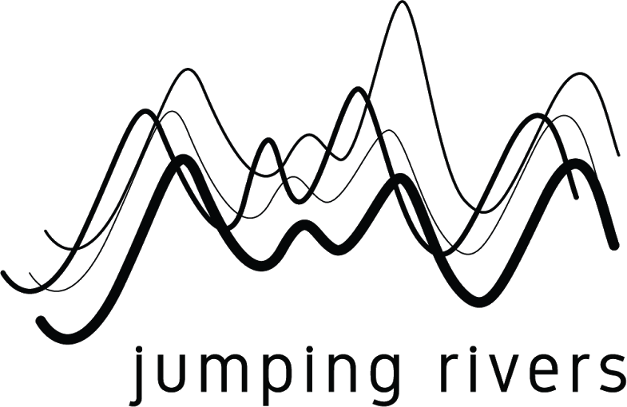

```{r setup, include=FALSE}
knitr::opts_chunk$set(echo = TRUE)

```


PyCon Limerick {data-navmenu="PyCon Limerick"}
====

Column 
--------------------

### PyCon Limerick 2020

<p>

<div>
<center>

</center>
</div>

<p>

<h4>Programme and Abstracts</h4>
<p>
* Date: Saturday 29th February 2020
* Location: Strand Hotel Limerick 
* Times: 10.00am to 17:10pm approx


<div>
<center>



</center>
</div>

About {data-navmenu="PyCon Limerick"}
=

Column
-------------------------------------------------------------

### Pycon Limerick 2020

PyCon Limerick 2020 will be returing to Limerick on Saturday 29th February 2020.
This one day conference is a mixture of talks and workshops on topics related to the Python Programming Language.


```{r child="summary.compare.Rmd"}
```

 	  	


Morning Session 2 {data-navmenu="Schedule"}
===
Column
-------------------------------


### Schedule

| Time   |  Room   |  Talk Title    |
|:-------|:-------|:------------------------------------------------------------|
|11:45-12:15 | Room 1	| **Dermot Canniffe** <br> Bias Engineering  |	
|11:45-12:15 | Room 2 |   | 
|11:45-12:15 | Room 3 | **Chidubem Iddianozie** <br> Discriminative Machine Learning models for semantifying IoT data: Why, How and Lessons Learnt.	| 
| | | ***(Pause)***|
|12:20-13.05 | Room 1| **Cheuk-Ho Ting** (PyData London) <br> Are you supporting the right politician? - Graph Visualization of Voting Data	|
|12:20-13.05 | Room 2| **Stephen Finucane** (Red Hat) <br> Getting started with Sphinx and Docutils 	|
|12:20-13.05 | Room 3| **Allyn Hunt** <br> Adding data visualisation to your Flask app with React Victory charts |
| | | |
| 11:20-11:45 | | ***Lunch Break*** |

Afternoon Session 1 {data-navmenu="Schedule"}
===

Column
----------------------------------------------

### Schedule

| Time   |  Room   |  Talk Title    |
|:-------|:-------|:------------------------------------------------------------|
|14.15 - 14:45| Room 1 | **Miguel Grinberg** <br> I Want To Know What You Did Last Summer (engaging with the Python Community)	|	 
|14.15 - 14:45| Room 2 | **James Nagle** (Kerry Data Science) <br> Social Network of 1916 Rising |	
|14.15 - 14:45| Room 3 |  **Olga Lyashevska** (GMIT) <br> Class imbalance in gradient boosting classification algorithms: application to experimental stroke data|	 
|  |  |   |
|14.50 - 15.20 | Room 1 |	 **Iain Keaney**  (Skellig  ai) <br> High-Level APIs for Machine Learning	|	 
|14.50 - 15.20 | Room 2 |  **Prashant Chaubey** <br> Writing Good Python Code	|	
|14.50 - 15.20 | Room 3 |  **Stephen McEntee** <br> Trees for structure and support in Python	|	 
| | | |
|15.20-15.45 | | Coffee Break | 


Post Conference Social 
=

Column
-----------------------------

### Post Conference Social 


<p>

<div>
<center>

</center>
</div>

<p>

<br>

The PyCon Limerick 2020 will conclude with a social event at J.J. Bowles on at 17:30.


